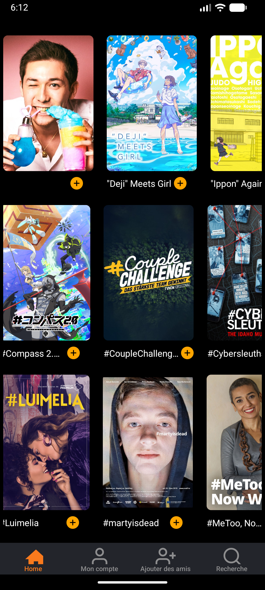
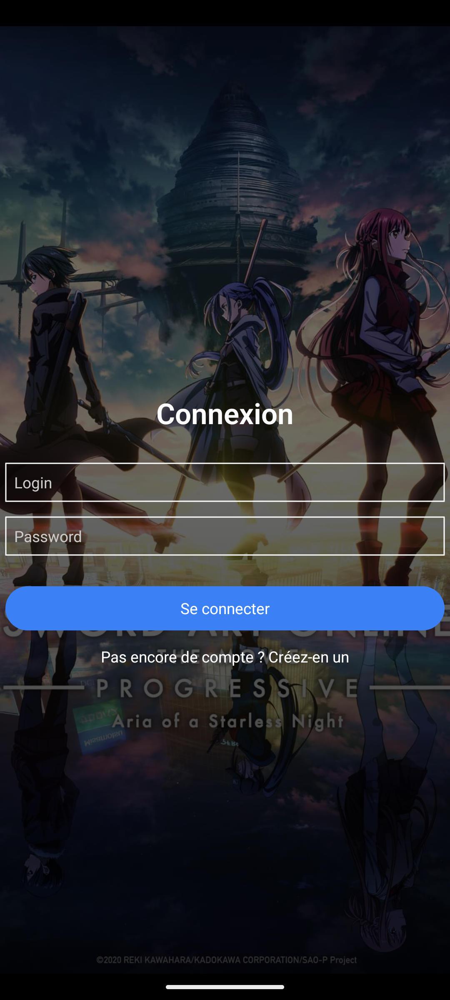
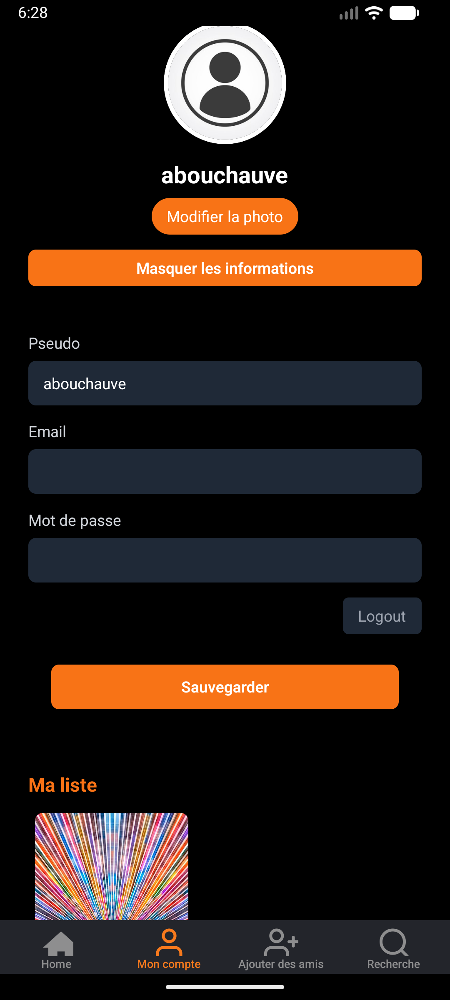
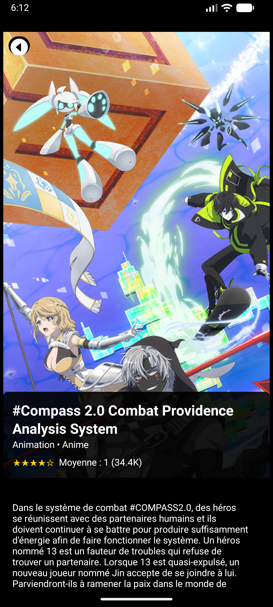
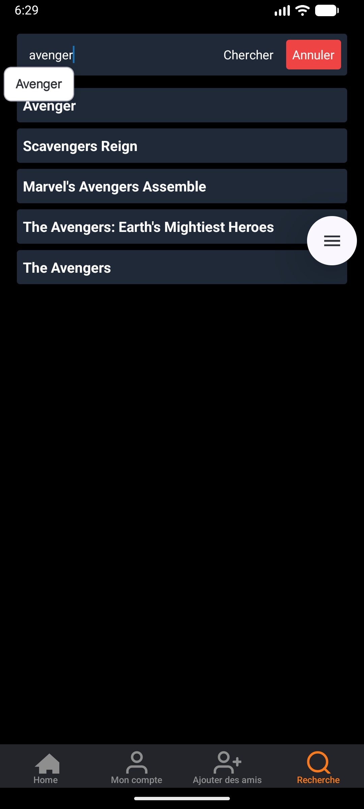
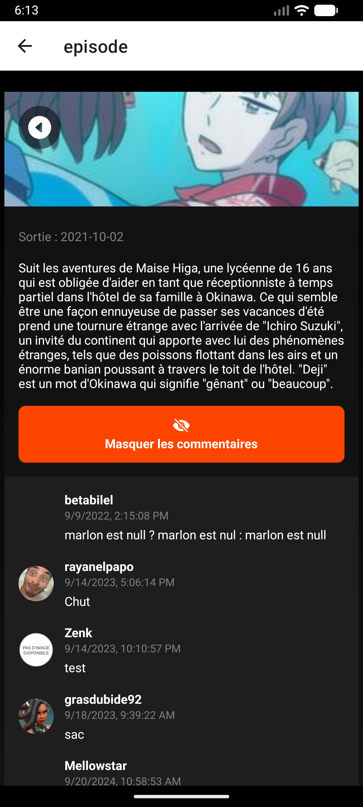

# CrunchyClone

[](https://expo.dev/)
[](https://reactnative.dev/)
[](https://www.typescriptlang.org/)
[](https://opensource.org/licenses/MIT)

A modern React Native application for tracking and discovering movies and TV series, powered by the BetaSeries API. Built with Expo Router for seamless navigation and a native mobile experience.

## ✨ Features

- **📺 Content Discovery**: Browse and search through an extensive database of movies and TV series
- **📝 Personal Tracking**: Keep track of what you've watched and what's on your watchlist
- **🔍 Advanced Search**: Find movies, shows, and connect with other users
- **👤 User Profiles**: View and edit your profile with personalized content
- **💬 Episode Comments**: Engage with the community by commenting on episodes
- **🌙 Dark Theme**: Elegant dark interface for comfortable viewing

## 📱 Screenshots

<p align="center">
  
  
  
</p>

<p align="center">
  
  
  
</p>
## 🚀 Getting Started

### Prerequisites

- Node.js (v16 or higher)
- npm or yarn
- Expo CLI (`npm install -g expo-cli`)
- BetaSeries API key ([Get one here](https://www.betaseries.com/api))

### Installation

1. Clone the repository:
```bash
git clone https://github.com/yourusername/CrunchyClone.git
cd CrunchyClone
```

2. Install dependencies:
```bash
npm install
# or
yarn install
```

3. Configure your API credentials:
    - Create a `.env` file in the root directory
    - Add your BetaSeries API key:
   ```
   BETASERIES_API_KEY=your_api_key_here
   ```

4. Start the development server:
```bash
npx expo start
```

5. Run on your device:
    - Download the Expo Go app on your iOS or Android device
    - Scan the QR code displayed in your terminal
    - Or press `i` for iOS simulator or `a` for Android emulator

## 🛠️ Tech Stack

- **Framework**: [React Native](https://reactnative.dev/) - Cross-platform mobile development
- **Routing**: [Expo Router](https://expo.github.io/router/) - File-based routing for React Native
- **Platform**: [Expo](https://expo.dev/) - Development platform and tools
- **API**: [BetaSeries API](https://www.betaseries.com/api) - Movies and TV series data
- **Language**: TypeScript/JavaScript - Type-safe development

## 🌐 API Integration

This app uses the [BetaSeries API](https://www.betaseries.com/api) to fetch:
- Movie and TV series information
- User data and profiles
- Comments and community interactions
- Personal watchlists and viewing history

### Key Endpoints Used:
- `/movies/list` - Browse movies
- `/shows/list` - Browse TV series
- `/members/infos` - User profile data
- `/comments/comments` - Episode comments
- `/search/all` - Search functionality


## 🙏 Acknowledgments

- [BetaSeries](https://www.betaseries.com/) for providing the API
- [Expo](https://expo.dev/) for the amazing development platform
- The React Native community for continuous support

## 📧 Contact

For questions or suggestions, feel free to open an issue or reach out to the maintainers.

---

